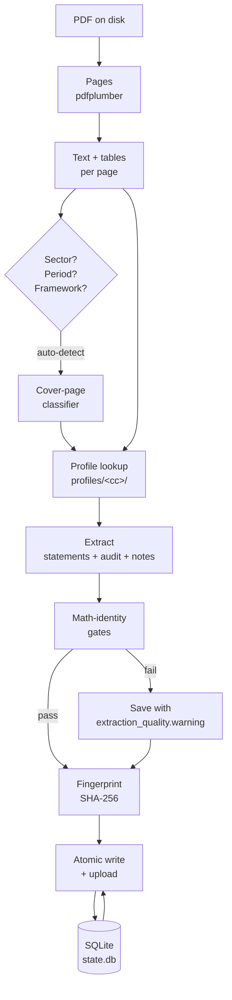

# Architecture

The engine is **one PDF → one filing JSON**, with a small but rigid
contract: math-identity gates prevent silent data corruption, the
SQLite-backed state machine makes batches idempotent and resumable,
and stable text fingerprints make the output reproducible.

---

## At a glance


---

## Data flow



The diagram is a one-pass picture. Each box maps to a real module:

| Box | Module |
|---|---|
| Pages | `pdfplumber` (no engine code) |
| Text + tables | `pdfplumber.Page.extract_text()` + `extract_tables()` |
| Sector / period / framework | `qscreen_autodetect.py` |
| Profile lookup | `profiles/__init__.py` → `profiles.<jurisdiction>.build_profile` |
| Extract | `qscreen_ingest.py` (the `extract_filing(...)` core) |
| Math-identity gates | `qscreen_gates.py` |
| Fingerprint | `qscreen_fingerprint.py` |
| SQLite state | `qscreen_state.py` |
| Save + upload | `qscreen_ingest.upload_filing(...)` with `If-None-Match` |

## Pluggable profiles

A "jurisdiction" is a sub-package of `profiles/` (e.g. `profiles/qatar/`)
that exposes five things:

- `JURISDICTION_NAME` — human-readable label, e.g. `"Qatar"`.
- `build_profile(ticker)` — full static profile, or `None` if the ticker
  isn't on this exchange.
- `profile_for_year(ticker, year)` — profile resolved as of a fiscal
  year (framework timeline, name changes, subsidiaries active events).
- `taxonomy()` — sector → sub-sector → archetype tree.
- `symbol_subsector()` + `subsector_to_archetype()` — ticker → sub-sector
  map and the cross-walk to the engine's 5 extraction archetypes.

The Qatar sub-package ships in the box (55 tickers, hand-curated
taxonomy, framework timeline, watch-KPIs, 25 issuer-specific facts).
UAE / SA / KW are one directory drop away — see
[Jurisdictions](jurisdictions.md).

The engine itself doesn't know about Qatar. If you don't pass
`--symbol`, no profile is loaded and the engine works purely on what's
in the filing — useful for one-off foreign issuers.

## Math-identity gates

`qscreen_gates.py` runs five sanity checks against the merged filing.
Failures never reach the validator; they're stamped onto
`extraction_quality.warnings[]` and the file is saved but **not**
uploaded. This is the **belt** that catches the "the LLM decided 30
should be 3,000,000" failure case.

1. **Skeleton pages** — pages with ≥80 % null cells (text-only cover or
   blank spread). → `severity: high`.
2. **Balance-sheet identity** — `total_assets ≈ total_liabilities +
   total_equity` (relative tolerance 1e-4). → `severity: high` if
   outside tolerance.
3. **Income statement subtotals** — sign-aware (`operating_income =
   revenue - expenses`, etc.). `severity: medium` if outside tolerance.
5. **Currency sanity** — single reporting currency per file; mismatches
   against the profile's value yield `severity: low`.
6. **Unit sanity** — single unit (thousands / millions / billions) per
   file; mismatches yield `severity: low`.

In addition, `profiles/qatar/pre_flags.py` keeps a **pre-flag catalog**:
issuer-specific knowledge (ZHCD 8 of 10+ years qualified, AKHI corpus
misclassifies as `islamic_bank`, QIGD entity changed 3× via renames,
UDCD IP at 47 % of TA, etc.). This emits `red_flags[]` on the saved
JSON, not just at call time.

## SQLite state machine + idempotent upload

`qscreen_state.py` owns the SQLite state at
`~/.qstocks-filing-tool/state.db`. The state machine is small:

| Column | Purpose |
|---|---|
| `row_id` | hash of `(manifest_path, row_index)` — stable across re-runs |
| `pdf` | path or URL of the source PDF |
| `symbol`, `sector`, `year`, `period` | the manifest row |
| `status` | `pending` / `claimed` / `done` / `uploaded` / `error` |
| `fingerprint` | the SHA-256 fingerprint of the produced filing |
| `output_path` | path of the saved `<SYM>_<YEAR>_<P>_filing.json` |
| `uploaded_at` | ISO timestamp of the upload |
| `error` | error message if `status == 'error'` |

The `claim_row` operation is **atomic** — multiprocessing-safe. A run
with `--jobs 4` and 100 rows will see exactly 4 rows in `claimed`
state at any moment, and exactly 1 worker per row. A crashed run
leaves `claimed` rows behind; the next `--resume` reclaims them.

### Idempotent upload

The upload uses `If-None-Match: <fingerprint>` against the remote
service. A repeat fingerprint is a 412, and the client treats 412 as
"already uploaded" (no retry, no error). This means the same filing
never uploads twice — even if the manifest is re-run, the worker is
restarted, or the network drops mid-upload.

Combined: a `--manifest` run can be interrupted, restarted on a
different machine, run with a higher `--jobs`, and resumed — and the
final state is the same as if it had run through clean.

## Stable text fingerprints

`qscreen_fingerprint.py` computes a SHA-256 over whitespace-normalized
text, with three scopes:

- `audit` — only the audit opinion section.
- `statements` — the three financial statements (IS, BS, CF).
- `notes` — the accounting notes.
- `overall` — order-independent combination of the above.

The fingerprint is **deterministic across re-extractions**: the same
input PDF + the same engine version produces the same fingerprint.
This means:

- A re-run of the same PDF produces a byte-identical filing JSON
  (modulo `metadata.extracted_at`).
- A change to the audit language produces a different `audit`
  fingerprint but the same `statements` fingerprint.
- A restated number produces a different `statements` fingerprint.
- A footnote edit produces a different `notes` fingerprint.

`qscreen_fingerprint diff` reports the scopes that differ, so a
quant looking at a re-filed PDF knows whether it's a number that
moved (restatement) or a footnote that moved (disclosure change).

```bash
# Print fingerprint scopes for one filing
python -m qscreen_fingerprint print path/to/QNBK_2023_FY_filing.json

# Diff two filings
python -m qscreen_fingerprint diff old.json new.json
```

## Auto-detect

`qscreen_autodetect.py` reads the filing's cover page (first 3 pages)
and infers:

- **Sector** (one of the 5 archetypes).
- **Fiscal period** (`FY` / `Q1` / `Q2` / `Q3` / `Q4` / `H1` / `9M`).
- **Reporting framework** (`IFRS` / `IFRS as adopted by QCB (Islamic)`
  / `AAOIFI` / etc.).

Auto-detect is **default ON**. The engine **never** overwrites an
operator-provided value — if you pass `--sector islamic_bank --period
FY --framework IFRS`, those are used as-is. The auto-detect only
fills missing values.

Use `--no-auto-detect` to require explicit values everywhere.

## Language detection

`qscreen_langdetect.py` is a pure-Unicode Arabic/English classifier
(no model weights, zero dependencies). For every filing it emits:

- `metadata.languages[]` — the set of languages detected in the
  document (`["en"]`, `["ar"]`, or `["ar", "en"]` for bilingual
  filings).
- `filing.page_languages{}` — `{page_number: "ar"|"en"}` per page.

Bilingual filings (Arabic + English side-by-side, common in GCC
annual reports) are handled correctly.

## Public API surface

```
qscreen_ingest           CLI entry point + library API (qscreen-ingest)
qscreen_app              Flask app entry point (qscreen-app)
qscreen_series           Time-series helpers (TTM, YoY, CAGR)
qscreen_analyze          Ratio + red-flag + valuation analysis
qscreen_dcf              Discounted-cash-flow model
qscreen_report           One-page analyst report (HTML + MD)
qscreen_portfolio        Multi-ticker portfolio rollups
qscreen_workbook         Multi-year Excel workbook from many filings
qscreen_statements       Statements assembly
qscreen_charts           Chart rendering for reports
qscreen_periods          Fiscal-period helpers

# 1.2.0
qscreen_gates            Math-identity gates
qscreen_state            SQLite-backed batch state

# 1.3.0 – 1.6.0
qscreen_eval             Golden-set evaluation harness
qscreen_autodetect       Cover-page sector / period / framework classifier
qscreen_langdetect       Arabic / English page classifier
qscreen_fingerprint      SHA-256 stable text fingerprints
```

The module list lives in `pyproject.toml` under
`[tool.setuptools].py-modules`. Adding a new top-level module
requires both the source file **and** the `py-modules` entry.

## What's deliberately not in the engine

- **No LLM-only mode**. The engine always produces deterministic
  line items (table extraction). The LLM pass adds opinion +
  notes + sector; it never edits line items.
- **No remote state**. Everything runs offline except the LLM call
  and the optional qscreen.app upload.
- **No hardcoded exchange / currency / framework.** The original
  QSE constants live in `profiles/qatar/`. UAE / SA / KW are
  equally first-class.

## Next

- → [Jurisdictions](jurisdictions.md): drop in `profiles/<cc>/`.
- → [Bench](bench.md): the golden-set harness + the 80.6 % baseline.
- → [CI](ci.md): how the four workflows gate the engine.
